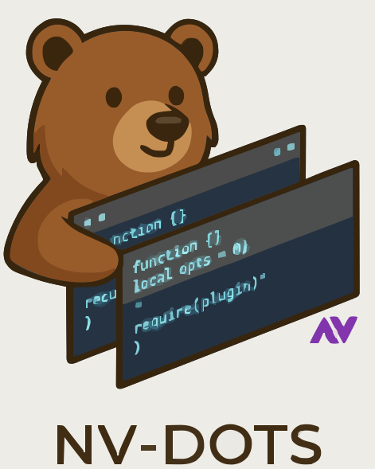

<p align="center">
  
</p>

<h1 align="center">💤 NV-Dots</h1>

<p align="center">
  Meu ambiente Neovim personalizado, baseado no 
  <a href="https://github.com/NvChad/starter" target="_blank">NvChad/starter</a>.<br/>
  Construído para produtividade e foco no desenvolvimento em 
  <b>Golang</b>, <b>Python</b>, <b>TypeScript</b> e <b>JavaScript</b>.
</p>

<p align="center">
  <a href="./docs/README.md">🌐 Read this in English</a>
</p>

---

## 🚀 Sobre o projeto

**NV-Dots** é o meu setup pessoal do Neovim, criado sobre o ecossistema do [NvChad](https://github.com/NvChad/NvChad) — uma das distribuições mais poderosas e modernas disponíveis para o editor.

A proposta é manter um ambiente **minimalista**, **rápido** e **altamente produtivo**, com configurações otimizadas para as linguagens que utilizo no meu dia a dia.

---

## 🧠 Linguagens suportadas

| Linguagem | Recursos principais |
|------------|----------------------|
| 🦫 **Golang** | LSP, linting, formatação e snippets via `gopls` |
| 🐍 **Python** | Integração com `pyright`, `ruff` e `black` |
| 🟦 **TypeScript / JavaScript** | LSP via `tsserver` e suporte ao ecossistema Node |
| ⚙️ **Outras linguagens** | Configuração base do NvChad para sintaxe e navegação |

---

## ⚙️ Instalação

1. Certifique-se de que o Neovim (>= 0.9) está instalado.
2. Remova ou faça backup de qualquer configuração anterior:
   ```bash
   mv ~/.config/nvim ~/.config/nvim.backup
   ```

3. Clone este repositório:

   ```bash
   git clone https://github.com/Diaszano/NV-Dots ~/.config/nvim
   ```
4. Inicie o Neovim:

   ```bash
   nvim
   ```

   O NvChad cuidará automaticamente da instalação dos plugins.

---

## 🧩 Estrutura básica

```
~/.config/nvim
├── lua
│   ├── configs/         # Configurações específicas de plugins
│   ├── highlights/      # Ajustes de temas e cores
│   ├── mappings/        # Mapeamentos personalizados
│   ├── plugins/         # Lista de plugins extras
│   └── custom/          # Overrides e personalizações do NvChad
└── init.lua             # Ponto de entrada da configuração
```

---

## 💡 Filosofia

* **Produtividade acima de tudo:** atalhos, formatação e LSP bem integrados.
* **Foco nas linguagens que mais uso.**
* **Base sólida:** aproveitando o poder do NvChad sem reinventar a roda.
* **Visual agradável:** combina desempenho com uma experiência moderna e elegante.

---

## 🧭 Créditos

* [NvChad](https://github.com/NvChad/NvChad) — A base de toda essa configuração incrível.
* [NvChad Starter Template](https://github.com/NvChad/starter) — O ponto de partida deste repositório.

---

## 🧑‍💻 Autor

**Lucas Dias**
💼 [github.com/Diaszano](https://github.com/Diaszano)
📘 Configurações feitas com 💙, curiosidade e vontade de aprender.

---

## 🪶 Licença

Este projeto segue a mesma licença do [NvChad](https://github.com/NvChad/NvChad) — [GPLv3](https://www.gnu.org/licenses/gpl-3.0.html).~~~~
